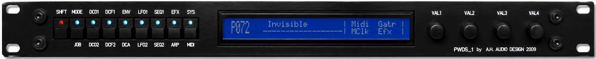

# RTAL WELLENKRAFT 8051

## An engineering archive documenting the design and implementation of a complete polyphonic digital synthesizer built around the classic 8051 architecture.

> **A complete digital synthesizer engineered from the ground up.**
>
> **Hand-written 8051 Assembly. Custom Hardware. Professional Audio
> Design.**

------------------------------------------------------------------------

## The RTAL WELLENKRAFT in its original working environment


*Figure 1 – The RTAL WELLENKRAFT in its original 2009 working environment*
</p>

*Figure 2 – The RTAL WELLENKRAFT Frontview*
</p>
------------------------------------------------------------------------

# In 2018, I Asked Myself One Question

> **How far can a classic 8051 microcontroller be pushed?**

Most engineers would have chosen a modern ARM processor or a dedicated
audio DSP.

I deliberately chose a different path.

The Silicon Labs **C8051F120** had become my preferred embedded platform
after years of professional development. I knew its architecture, timing
behaviour and peripherals intimately.

The challenge was simple:

**Could a professional polyphonic wavetable synthesizer be built
entirely around that processor?**

The answer became **WELLENKRAFT 8051**.

------------------------------------------------------------------------

# Engineering at a Glance

-   🎹 8 Voice Polyphony
-   🌊 Two DDS Oscillators per Voice
-   🎛 Digital Filter per Voice
-   🎚 Independent DCA / DCF Envelopes
-   🎵 Complete MIDI Implementation
-   ⏱ MIDI Clock Synchronisation
-   💾 External SPI Flash Wave Memory
-   ✨ SPIN FV‑1 Stereo DSP
-   🖥 Ctrlr Editor
-   ⚙ 100% 8051 Assembly Firmware

------------------------------------------------------------------------

# Design Philosophy

This project was never about proving that old hardware is "better".

It was about demonstrating what is possible when hardware, software and
system architecture are designed together with a deep understanding of
the platform.

Every engineering decision was intentional.

------------------------------------------------------------------------

# Why These Design Decisions?

## Why the 8051?

The C8051F120 was the processor I trusted most.

Years of embedded development had given me confidence in its
deterministic behaviour, interrupt latency and peripheral architecture.

My work at the Technical University of Dortmund also provided access to
professional development tools and laboratory equipment.

------------------------------------------------------------------------

## Why Assembly Language?

For real-time synthesis, predictability is everything.

Assembly Language allowed absolute control over execution timing, RAM
usage and hardware access.

No compiler overhead.

No hidden optimisations.

Every instruction exists for a reason.

📷 *Insert assembly source screenshot.*

------------------------------------------------------------------------

## Why Two Independent Voice Engines?

Benchmarking showed that one processor could generate four complete
voices while maintaining deterministic timing.

Instead of simplifying the synthesis engine, I duplicated it.

Processor A: - Voices 1--4

Processor B: - Voices 5--8

The result is true eight-voice polyphony without sacrificing synthesis
quality.


*Figure 3 – The RTAL WELLENKRAFT 8051 Modul 1*
</p>

*Figure 4 – The RTAL WELLENKRAFT 8051 Modul 2*
</p>

*Figure 5 – The RTAL WELLENKRAFT 8051 Modul 2 with connected FV-1 Modul*
</p>

------------------------------------------------------------------------

## Why an External FV‑1?

The synthesis processors should create sound---not compute long reverbs.

The SPIN FV‑1 provides dedicated stereo effects while the 8051
processors remain focused on deterministic synthesis.

Several effect programs were written specifically for WELLENKRAFT 8051
and stored in external EEPROM devices.


------------------------------------------------------------------------

# System Architecture

-   Ctrlr Editor
-   MIDI
-   Processor A
-   Processor B
-   Audio Mixer
-   FV‑1 DSP
-   Stereo Output

------------------------------------------------------------------------

# Hardware Gallery

Suggested order:

1.  Hero photograph
2.  Front panel
3.  Rear panel
4.  Internal overview
5.  Processor board A
6.  Processor board B
7.  Effects board
8.  Power supply
9.  Prototype hardware
10. Development photos

------------------------------------------------------------------------

# Ctrlr Editor


-   Main editor
-   Oscillator page
-   Filter page
-   Modulation page
-   Effects page
-   Preset management

------------------------------------------------------------------------

# Inside the Firmware

Future documentation will explain:

-   DDS implementation
-   24-bit phase accumulators
-   Voice allocation
-   Digital filters
-   Envelope generators
-   MIDI parser
-   Interrupt scheduler
-   Flash memory organisation
-   Performance optimisation

------------------------------------------------------------------------

# Lessons Learned

Looking back, the most valuable lesson from WELLENKRAFT 8051 is that
outstanding embedded systems are built through understanding---not
simply by selecting faster hardware.

Knowledge of the architecture proved more valuable than processor
performance alone.

Many concepts developed here later influenced subsequent RTAL
synthesizers.

------------------------------------------------------------------------

# Repository Layout

``` text
Assembly/
Firmware/
Hardware/
Schematics/
Ctrlr/
Documentation/
Images/
Audio/
Measurements/
Articles/
```

------------------------------------------------------------------------

# About RealTimeAudioLab

RealTimeAudioLab (RTAL) documents complete engineering projects spanning
embedded systems, digital audio, custom hardware and electronic musical
instruments.

Every repository is intended to preserve both the finished instrument
and the engineering journey that created it.
